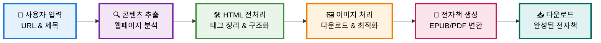
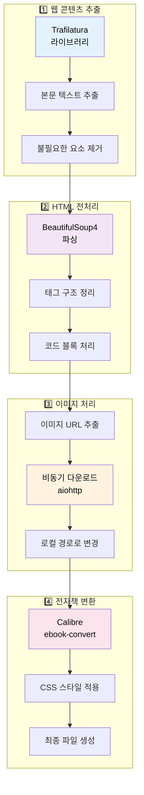

# BlogToBook

블로그 포스트를 전자책으로 변환하는 웹 서비스입니다.

## 데모

웹사이트에서 바로 사용해보세요: [BlogToBook](https://www.blog2book.store)

## 특징

- **간단한 사용법**: URL만 붙여넣으면 전자책 완성
- **다양한 포맷**: EPUB과 PDF 지원
- **실시간 진행상황**: 변환 과정을 실시간으로 확인
- **복수 포스트 지원**: 여러 글을 하나의 전자책으로 묶기
- **로그인 불필요**: 회원가입 없이 바로 사용

## 지원 플랫폼

- Brunch (브런치)
- Tistory (티스토리)
- Jekyll 기반 블로그

## 사용법

1. 전자책 포맷 선택 (EPUB/PDF)
2. 책 제목 입력
3. 블로그 포스트 URL 입력
4. '전자책 만들기' 클릭
5. 변환 완료 후 다운로드

## 전자책 변환 프로세스



### 🔧 기술적 구현 흐름



### 변환 과정 상세

1. **콘텐츠 추출**
   - Trafilatura를 사용하여 웹페이지에서 본문 추출
   - 광고, 내비게이션 등 불필요한 요소 제거
   - HTML 형식으로 구조화된 콘텐츠 생성

2. **이미지 처리**
   - 모든 이미지를 비동기적으로 다운로드
   - 이미지 파일을 로컬에 저장
   - HTML 내 이미지 링크를 로컬 경로로 변경

3. **문서 구조화**
   - 제목 구조 분석 및 목차 생성
   - 코드 블록 및 인용문 스타일링
   - 폰트 및 CSS 스타일 적용

4. **전자책 변환**
   - Calibre를 사용하여 HTML을 전자책 포맷으로 변환
   - 메타데이터 추가 (제목, 저자 등)
   - 최종 파일 생성

## 기술 스택

**Backend**
- FastAPI
- Trafilatura (콘텐츠 추출)
- Calibre (전자책 변환)
- aiohttp (이미지 다운로드)

**Frontend**
- Vanilla JavaScript
- Bulma CSS
- Server-Sent Events

## 프로젝트 구조

```
BlogToBook/
├── app/
│   ├── main.py                    # 애플리케이션 진입점
│   ├── api/v1/endpoints/          # API 엔드포인트
│   ├── services/                  # 비즈니스 로직
│   │   ├── content/              # 콘텐츠 추출
│   │   ├── converter/            # 전자책 변환
│   │   └── image/                # 이미지 처리
│   ├── static/                   # CSS, 폰트
│   └── view/templates/           # HTML 템플릿
├── output/                       # 생성된 전자책
└── pyproject.toml               # 프로젝트 설정
```

## 로드맵

- [ ] AI 커버 이미지 생성
- [ ] AI 제목 추천
- [ ] 네이버 블로그 지원
- [ ] 스타일 커스터마이징
- [ ] 목차 편집 기능

## 라이선스

이 프로젝트는 MIT 라이선스 하에 있습니다.

## 연락처

koesnam.dev@gmail.com